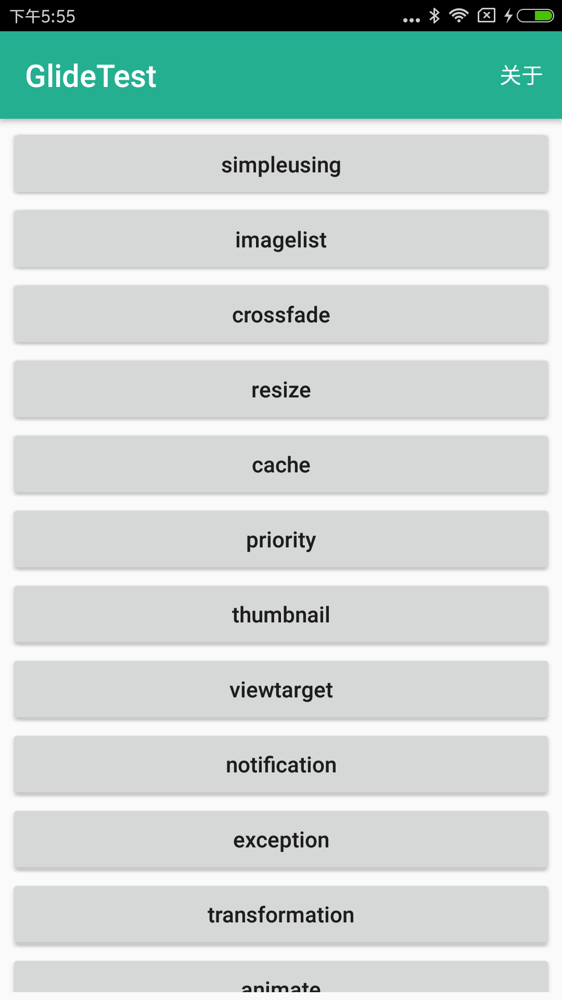

> This project is just only used to demonstrate basic use of [Glide](https://github.com/bumptech/glide) image load engine.

## Contents

 * [simpleusing - 入门](#simpleusing)
 * [imagelist - 列表图片](#imagelist)
 * [crossfade - 渐现动画](#crossfade)
 * [resize - 图片重设大小和缩放](#resize)
 * [cache - 缓存](#cache)
 * [priority - 请求优先级](#priority)
 * [thumbnail - 缩略图](#thumbnail)
 * [viewtarget - 自定义视图](#viewtarget)
 * [notification - 通知栏和应用小部件](#notification)
 * [exception - 异常](#exception)
 * [transformation - 自定义转换](#transformation)
 * [animate - 自定义动画](#animate)
 * [network - 集成网络栈](#network)
 * [https - 接受自定义证书的HTTPS](#https)
 * [customimagesize - 自定义图片尺寸优化加载图片](#customimagesize)
 * [loadprogress - 自定义带进度条加载图片](#loadprogress)
 * [Glide4.0 - 全面了解Glide4.0](#Glide4.0) work in progress

## Screenshot

## Discuss

Contact me: haoxunwang525@gmail.com

## Thanks

* [Glide](https://github.com/bumptech/glide)
* [Glide系列](https://mrfu.me/2016/02/27/Glide_Getting_Started/)
* [实现带进度的Glide图片加载功能](https://blog.csdn.net/guolin_blog/article/details/78357251)
* [OkHttp](https://github.com/square/okhttp)

## License

    Copyright 2017 haoxunwang

    Licensed under the Apache License, Version 2.0 (the "License");
    you may not use this file except in compliance with the License.
    You may obtain a copy of the License at

       http://www.apache.org/licenses/LICENSE-2.0

    Unless required by applicable law or agreed to in writing, software
    distributed under the License is distributed on an "AS IS" BASIS,
    WITHOUT WARRANTIES OR CONDITIONS OF ANY KIND, either express or implied.
    See the License for the specific language governing permissions and
    limitations under the License.